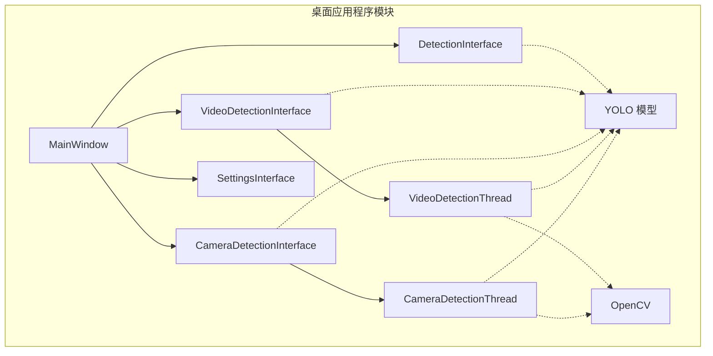

```mermaid
graph TD
    subgraph 桌面应用程序模块
        A[MainWindow] --> B[DetectionInterface]
        A --> C[VideoDetectionInterface]
        A --> D[CameraDetectionInterface]
        A --> E[SettingsInterface]
        
        C --> F[VideoDetectionThread]
        D --> G[CameraDetectionThread]
        
        B -.-> H[YOLO 模型]
        C -.-> H
        D -.-> H
        F -.-> H
        G -.-> H
        
        F -.-> I[OpenCV]
        G -.-> I
    end
```