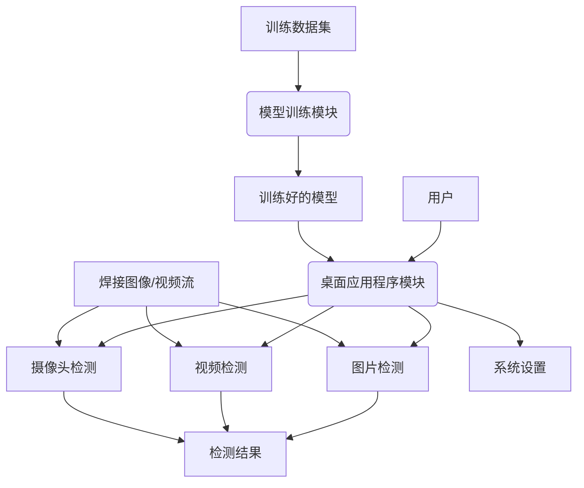

```mermaid
graph TD
    A[用户] --> B(桌面应用程序模块);
    B --> C[图片检测];
    B --> D[视频检测];
    B --> E[摄像头检测];
    B --> F[系统设置];
    
    G(模型训练模块) --> J;
    H[焊接图像/视频流] --> C;
    H --> D
    H --> E;
    I[训练数据集] --> G;
    J[训练好的模型] --> B;
    C --> K[检测结果];
    D --> K[检测结果];
    E --> K[检测结果];
```