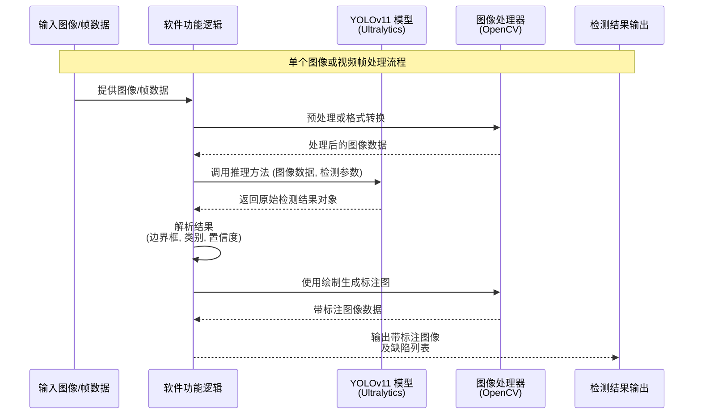

```mermaid
sequenceDiagram
    participant Input as 输入图像/帧数据
    participant SoftwareLogic as 软件功能逻辑
    participant YOLOModel as YOLOv11 模型<br>(Ultralytics)
    participant ImageProcessor as 图像处理器<br>(OpenCV)
    participant Output as 检测结果输出
    Note over Input, Output: 单个图像或视频帧处理流程
    Input ->> SoftwareLogic: 提供图像/帧数据
    SoftwareLogic ->> ImageProcessor: 预处理或格式转换
    ImageProcessor -->> SoftwareLogic: 处理后的图像数据
    SoftwareLogic ->> YOLOModel: 调用推理方法 (图像数据, 检测参数)
    YOLOModel -->> SoftwareLogic: 返回原始检测结果对象
    SoftwareLogic ->> SoftwareLogic: 解析结果<br>(边界框, 类别, 置信度)
    SoftwareLogic ->> ImageProcessor: 使用绘制生成标注图
    ImageProcessor -->> SoftwareLogic: 带标注图像数据
    SoftwareLogic -->> Output: 输出带标注图像<br>及缺陷列表
```