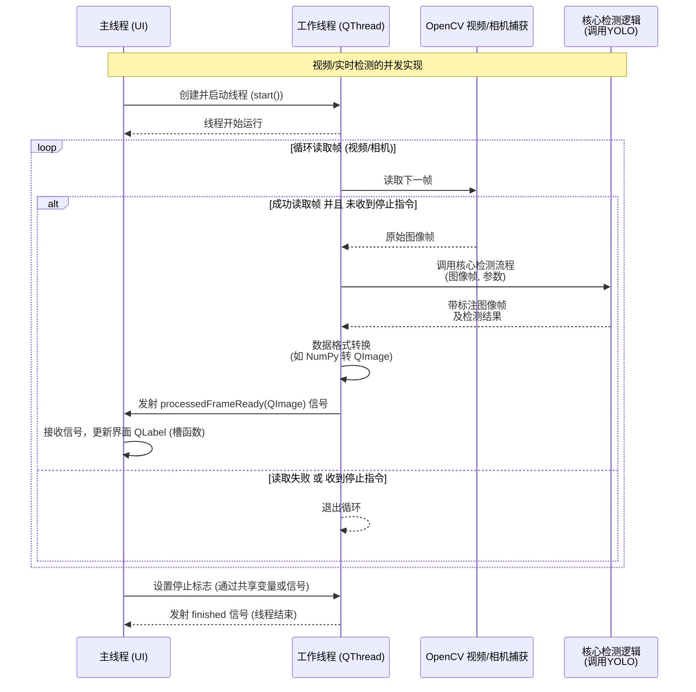

```mermaid
sequenceDiagram
    participant MainThread as 主线程 (UI)
    participant WorkerThread as 工作线程 (QThread)
    participant Capture as OpenCV 视频/相机捕获
    participant Detector as 核心检测逻辑<br>(调用YOLO)

    Note over MainThread, Detector: 视频/实时检测的并发实现

    MainThread ->> WorkerThread: 创建并启动线程 (start())
    WorkerThread -->> MainThread: 线程开始运行
    loop 循环读取帧 (视频/相机)
        WorkerThread ->> Capture: 读取下一帧
        alt 成功读取帧 并且 未收到停止指令
            Capture -->> WorkerThread: 原始图像帧
            WorkerThread ->> Detector: 调用核心检测流程<br>(图像帧, 参数)
            Detector -->> WorkerThread: 带标注图像帧<br>及检测结果
            WorkerThread ->> WorkerThread: 数据格式转换<br>(如 NumPy 转 QImage)
            WorkerThread ->> MainThread: 发射 processedFrameReady(QImage) 信号
            MainThread ->> MainThread: 接收信号，更新界面 QLabel (槽函数)
        else 读取失败 或 收到停止指令
            WorkerThread -->> WorkerThread: 退出循环
        end
    end
    MainThread ->> WorkerThread: 设置停止标志 (通过共享变量或信号)
    WorkerThread -->> MainThread: 发射 finished 信号 (线程结束)
```