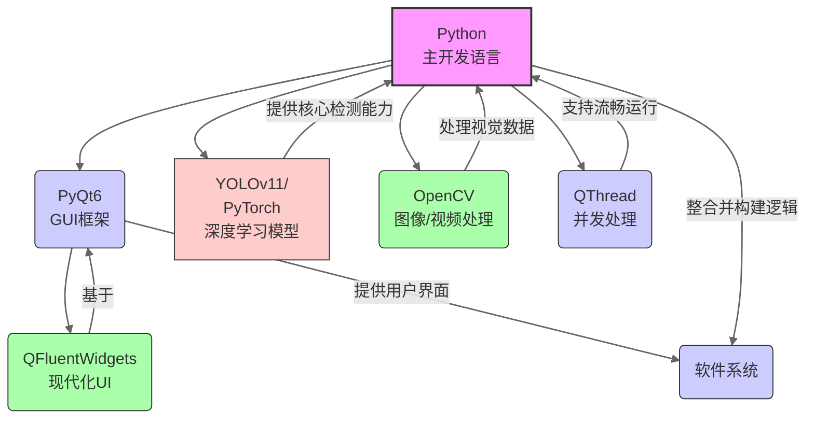

```mermaid
graph TD
    A[Python<br>主开发语言] --> B(PyQt6<br>GUI框架);
    B --> C(QFluentWidgets<br>现代化UI);
    A --> D[YOLOv11/<br>PyTorch<br>深度学习模型];
    A --> E(OpenCV<br>图像/视频处理);
    A --> F(QThread<br>并发处理);

    B -- 提供用户界面 --> G(软件系统);
    C -- 基于 --> B;
    D -- 提供核心检测能力 --> A;
    E -- 处理视觉数据 --> A;
    F -- 支持流畅运行 --> A;

    A -- 整合并构建逻辑 --> G;

    %% 可选的样式定义，不影响解析
    classDef main_lang fill:#f9f,stroke:#333,stroke-width:2px;
    classDef framework fill:#ccf,stroke:#333;
    classDef lib fill:#aaffaa,stroke:#333;
    classDef model fill:#ffcccc,stroke:#333;
    classDef system fill:#ccccff,stroke:#333;

    A:::main_lang;
    B:::framework;
    C:::lib;
    D:::model;
    E:::lib;
    F:::framework;
    G:::system;

    linkStyle 0,1,2,3,4,5,6,7,8,9,10 stroke:#666,stroke-width:1.5px;
```